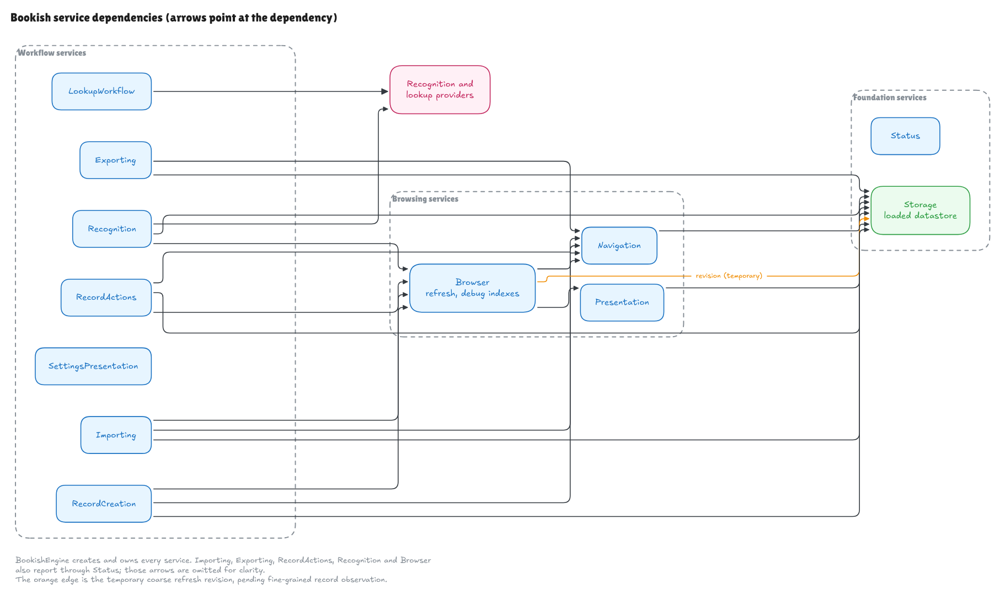
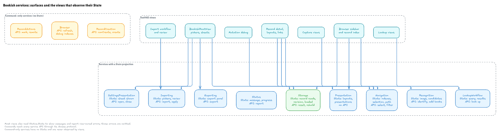

# Application Services

The `BookishApp` package implements the design in
[Command and Environment Design](Command%20and%20Environment%20Design.md) with
twelve services in `Dependencies/BookishApp/Sources/BookishApp/Services/`.
`BookishEngine` creates and owns them, vends each `API` to commands through its
`Access` protocol, and injects each `State` into SwiftUI.

## Services

| Service | `State` | `API` | Purpose |
|---|---|---|---|
| `BookishStorageService` | yes | yes | Loaded datastore, record reads, reset and rebuild |
| `BookishNavigationService` | yes | yes | Browser indexes, selection, and detail path |
| `BookishPresentationService` | yes | no | Layouts, presentations, and kind metadata |
| `BookishStatusService` | yes | yes | User-visible messages, errors, and progress |
| `BookishBrowserService` | no | yes | Debug-index visibility and browser refresh |
| `BookishImportingService` | yes | yes | Reading, reviewing, and applying imports |
| `BookishExportingService` | yes | yes | Interchange export and its save panel |
| `BookishSettingsPresentationService` | yes | yes | The iOS settings sheet |
| `BookishRecordCreationService` | no | yes | Creating records from New commands |
| `BookishRecordActionsService` | no | yes | Actions on the selected or visible record |
| `BookishRecognitionService` | yes | yes | Book recognition from captured images |
| `BookishLookupWorkflowService` | yes | yes | Metadata lookup against providers |

### Foundation

**`BookishStorageService`** owns the loaded `BookishDatastore`: opening and
seeding it, and the materialised records it serves. Other services that need
the datastore depend on this service instead of holding it directly. Its `State`
gives views read-only record, query-section, and mutation reads, whether storage
has loaded, and the record `revision`. Its `API` gives commands the datastore
folder, projection rebuild, and reset.

**`BookishStatusService`** owns the message and import progress shown in the
status bar. Commands and services report through its `API`; views report
view-owned loading errors through its `State`.

### Browsing

**`BookishNavigationService`** owns the browser route: the available indexes,
the selected index, main section, and record, the name filter, and the linked
record path. It persists the last selection. Its `State` is what the sidebar,
index, and detail views read, and its `API` serves the navigation commands.

**`BookishPresentationService`** resolves how records look: the selected or
index-default layout, type-specific layouts, cascading property presentations,
and record-kind metadata. It is view-facing only, so it has a `State` and no
`API`. The browser service refreshes it when the selected index changes.

**`BookishBrowserService`** owns whether debug-only indexes are visible and
refreshes the browser after records change: navigation's indexes, then
presentation's layouts, then the storage revision. It is command-facing only.

### Workflows

**`BookishImportingService`** owns the Import workflow. It reads interchange,
Delicious Library, and Kindle sources into a proposal without writing to
storage, keeps the user's review choices in its `State`, and applies the
reviewed proposal only if the catalogue has not changed meanwhile. Its `API`
serves the import commands; its `State` drives the file pickers and review
views.

**`BookishExportingService`** encodes records as a Bookish interchange file,
rooted at the selected record, and presents the save panel through its `State`.

**`BookishRecordCreationService`** creates standard records from the New menu
and toolbar. `canCreate(_:)` requires loaded storage and a library index whose
query includes the new record. `create(_:)` saves the record, switches to that
index, clears the filter, and selects the record.

**`BookishRecordActionsService`** applies actions to the selected record or to
a visible linked record: marking it as reading or finished, and simulating a
remote mutation for development.

**`BookishRecognitionService`** manages book capture: the selected image and
recognition provider, recognised candidates and their selection, and adding
selected candidates as book records.

**`BookishLookupWorkflowService`** queries configured metadata lookup providers
and holds the query, candidates, and failures for the Lookup section.

**`BookishSettingsPresentationService`** shows and hides the iOS settings
sheet. On macOS, settings use the standard Settings scene instead.

## Dependencies

Arrows point at the dependency. Most services also report through
`BookishStatusService`; those arrows are omitted.

## Views and state

Each group of views reads the `State` of the services whose data it displays.
Command-only services have no `State`, and views never observe them.

## Temporary browser refresh

Views do not yet observe the individual records and queries they display.
Services that write records therefore call `BookishBrowserService.API.refresh()`
afterwards, which advances `BookishStorageService.State.revision`, and record
views key their reload tasks on that revision. These calls and the revision are
marked `TEMPORARY` in the source, and go away with
[Fine-Grained Record Observation](../Journal/2026-09-25-fine-grained-record-observation.md).

## Source layout

`Services/` contains only the service files above. The package root holds
configuration, results, examples, and the import event reporter; `Errors/` holds
error types; `Extensions/` holds extensions of other modules' types; `Commands/`
holds the commands and `Views/` the SwiftUI views.

## Diagrams

The diagrams are Excalidraw drawings. Each PNG in `Diagrams/` sits beside its
`.excalidraw` source, which opens in Excalidraw for editing. The working copies
live in the Bookish collection in Excalidraw+:

- [Service shape](https://app.excalidraw.com/s/1qz0TDOQJGb/AiWQnDZ6NKx)
- [Service dependencies](https://app.excalidraw.com/s/1qz0TDOQJGb/4JPn6XCsQ1a)
- [Service surfaces and views](https://app.excalidraw.com/s/1qz0TDOQJGb/8B3UvcfRgBU)

After editing a scene, replace both files: the PNG from the Excalidraw MCP's
`take_screenshot` at 1920 pixels wide (renders fit within 1920×1080), and the
source from its `get_scene_content`. Keep diagrams wide rather than tall so
they stay legible within that size.
