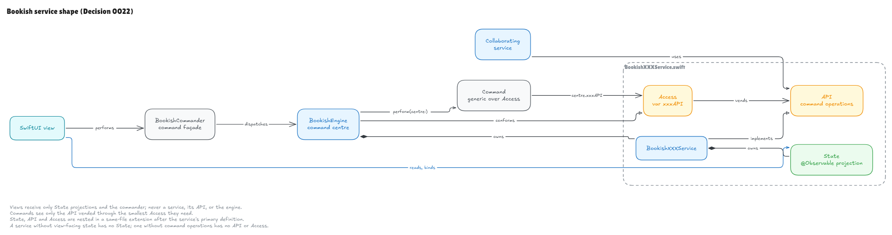

# Command and Environment Design

Bookish uses `BookishEngine` as the application composition root and command
centre. It owns service lifecycles and is the only object that commands use as
their concrete centre. SwiftUI receives a narrow `BookishCommander` façade
instead of the engine itself.

## Responsibilities

The engine has two distinct roles in the application:

- It executes commands as their concrete command centre.
- It owns the services that the application injects into SwiftUI.

Views receive `BookishCommander` through the SwiftUI environment so they can
use command helpers such as `button`, `toolbarItem`, and
`performWithoutWaiting`. The façade holds the engine privately and does not
expose service APIs. Views therefore cannot reach services through their
command dependency.

## Service shape

Each application service is a `BookishXXXService` class in `Services/`, following
[Decision 0022](../Decisions/0022-service-state-api-and-provider-shape.md). Its
source file declares up to three nested types, in a same-file extension after
the service's primary definition:

- `State`, the observable projection that views read. It exposes properties,
  bindings, and view-owned wiring such as `BookishStatusService.State.report(error:)`,
  never domain actions.
- `API`, the operations commands and collaborating services need.
- `Access`, the command-centre protocol that vends `any API` as `xxxAPI`.

A service without view-facing state has no `State`; a service without command
operations has no `API` or `Access`. `Services/` contains only service files.
Configuration, results, examples, and the import event reporter live in the
package root; errors live in `Errors/` and extensions in `Extensions/`.

| Service | `State` | `API` | Responsibility |
|---|---|---|---|
| `BookishStorageService` | yes | yes | Loaded datastore, record reads, reset and rebuild |
| `BookishNavigationService` | yes | yes | Browser indexes, selection, and detail path |
| `BookishPresentationService` | yes | no | Layouts, presentations, and kind metadata |
| `BookishStatusService` | yes | yes | User-visible messages, errors, and progress |
| `BookishBrowserService` | no | yes | Debug-index visibility and browser refresh |
| `BookishImportingService` | yes | yes | Reading, reviewing, and applying imports |
| `BookishExportingService` | yes | yes | Interchange export and its save panel |
| `BookishSettingsPresentationService` | yes | yes | The iOS settings sheet |
| `BookishRecordCreationService` | no | yes | Creating records from New commands |
| `BookishRecordActionsService` | no | yes | Actions on the selected or visible record |
| `BookishRecognitionService` | yes | yes | Book recognition from captured images |
| `BookishLookupWorkflowService` | yes | yes | Metadata lookup against providers |

Services collaborate through each other's `API`, or through the concrete
service where a collaborator needs more than commands do. The engine creates
every service and wires these dependencies.

## Commands and access protocols

Each command represents a user or application action. It owns its availability,
validation, and execution. A command is generic over the smallest
`BookishXXXService.Access` protocol that supplies the required capability.

The engine conforms to these access protocols by vending each service's `API`
as `xxxAPI`, while retaining concrete service ownership. A command must not
depend on the whole engine, a broad UI-state coordinator, or an unrelated
service merely because the engine happens to own it.

For example, a command that updates debug-index visibility depends on
`BookishBrowserService.Access`, which vends `BookishBrowserService.API` as
`browserAPI`. It does not depend on import, storage, record-action,
recognition, or navigation capabilities.

Command availability must read only observable state. Menus and controls
evaluate availability inside SwiftUI, and a value that is not observed is
evaluated once and never updated. For example, storage publishes whether it
has loaded through `BookishStorageService.State.isLoaded`.

New commands should follow this sequence:

1. Identify the action in user terms.
2. Add the smallest mutation method to the owning service's nested `API`.
3. If the service is new, add its nested `Access` and conform the engine to it.
4. Implement the command against that `Access` protocol.
5. Dispatch the command from the view through the environment-injected commander.
6. Test the command with a fake command centre and fake service `API`.

Command failures dispatched with `performWithoutWaiting` are reported through
the engine's command-failure handling and user-visible status service.

## View rules

Views should read state and dispatch discrete actions through commands. Examples
include selecting navigation destinations, importing a file selected by a system
picker, changing browser debug visibility, marking a record, and adding
recognition candidates.

Toolbar content belongs to the view that owns its context. Workflows offer
their own commands, the active index offers navigation and its configured New
action, and each visible book detail offers commands targeting that book's ID.
The iOS Settings toolbar action opens the app's settings sheet through a
command. Index records declare their creatable kinds in `newRecordTypes`,
separately from the advisory `types` used for presentation.

Direct bindings are a deliberate exception. SwiftUI controls such as `Picker`,
`Toggle`, and `NavigationStack(path:)` need stable bindings and may write their
bound value directly for now. A future command-intercepting binding wrapper may
wrap these bindings to record or dispatch their changes consistently. Until that
exists, do not replace a native binding with an ad-hoc command-backed binding.

Reporting a view-owned loading or picker error through
`BookishStatusService.State.report(error:)` is also an allowed UI reporting
effect. The state projection may expose methods for view-owned presentation
work; it does not expose the command-facing `API`.

## Read services in the environment

The environment injects the command façade and each service's `State`, using
its exact type. Views never receive a concrete service, its `API`, or the
engine. Record views resolve stored records through
`BookishStorageService.State`, which exposes read-only queries and the record
revision that keys their reload tasks, and resolve layouts and presentations
through `BookishPresentationService.State`. Import review, export, and Settings
presentation read the `State` projections of `BookishImportingService`,
`BookishExportingService`, and `BookishSettingsPresentationService`.

Services that write records call `BookishBrowserService.API.refresh()` afterwards,
which advances the storage revision so record views reload. This is a temporary
workaround until views observe their own records and queries; see
[Fine-Grained Record Observation](../Journal/2026-09-25-fine-grained-record-observation.md).

The façade intentionally exposes only command dispatch and command UI helpers.
Views should report allowed view-owned loading and picker failures through the
environment-injected status state. All domain mutations continue to use
commands, except for the documented direct-binding exception above.

If compile-time prevention of direct mutation becomes necessary, keep mutable
services out of the UI module and inject only read-only state across the module
boundary. Within one Swift module, this policy is expressed through narrow APIs,
commands, review, and tests rather than absolute access control.

## Diagrams

The diagrams are Excalidraw drawings. Each PNG in `Diagrams/` sits beside its
`.excalidraw` source, which opens in Excalidraw for editing. The working copies
live in the Bookish collection in Excalidraw+:

- [Service shape](https://app.excalidraw.com/s/1qz0TDOQJGb/AiWQnDZ6NKx)
- [Service dependencies](https://app.excalidraw.com/s/1qz0TDOQJGb/4JPn6XCsQ1a)
- [Service surfaces and views](https://app.excalidraw.com/s/1qz0TDOQJGb/8B3UvcfRgBU)

After editing a scene, replace both files: the PNG from the Excalidraw MCP's
`take_screenshot` at 1920 pixels wide (renders fit within 1920×1080), and the
source from its `get_scene_content`. Keep diagrams wide rather than tall so
they stay legible within that size.

## Related documents

- [Project Layout](Project%20Layout.md) describes the command-driven app
  structure.
- [Datastore Implementation](Datastore%20Implementation.md) describes the
  record-service and mutation-service split.
